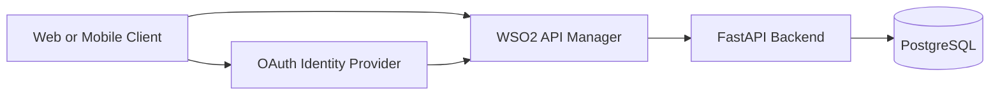

# Secure Healthcare API Platform

> **Current phase:** API design, security planning, and repository foundation only. FastAPI implementation and WSO2 API Manager installation/configuration are intentionally deferred.

## Problem statement

Healthcare APIs commonly suffer from inconsistent authentication, excessive permissions, missing rate limits, limited monitoring, weak lifecycle management, and accidental exposure of sensitive data. This educational project establishes a secure, contract-first foundation for a healthcare appointment API without using real patient information.

## Objective

Design an appointment platform where patients discover doctors and manage their own appointments, doctors manage appointments assigned to them, and administrators manage doctors, patients, schedules, and appointments. A future WSO2 API Manager layer will publish, secure, govern, version, rate-limit, document, and monitor the FastAPI backend.

## Proposed architecture



The gateway validates JWTs and scopes; the backend independently enforces roles, ownership, and business rules. PostgreSQL is the authoritative data store. See [docs/architecture.md](docs/architecture.md) for trust boundaries and request flows.

## Roles

- **Patient:** views doctors and availability; creates, views, and cancels only their own appointments.
- **Doctor:** views assigned appointments and updates or cancels them when policy permits.
- **Administrator:** manages doctors, patients, schedules, and all appointments; accesses administrative reports.

Access is denied by default and granted according to least privilege. Gateway scope checks never replace backend object-level authorization.

## Planned technology stack

Python 3.12, FastAPI, SQLAlchemy, Alembic, PostgreSQL, Docker, WSO2 API Manager, OAuth 2.0, OpenID Connect, and JWT access tokens.

## MVP

- Authentication and OAuth scope protection
- Doctor directory and availability
- Patient appointment creation, viewing, and cancellation
- Doctor appointment management
- Administrative doctor, patient, schedule, and appointment management
- Rate limiting, API versioning, analytics, OpenAPI documentation, and security audit logging

## Excluded from version 1

Diagnoses, prescriptions, laboratory reports, insurance claims, video consultations, payments, medical document uploads, and all real patient data are excluded.

## Repository structure

```text
.
├── api-spec/                 # OpenAPI 3.0.3 contract
├── backend/                  # Future FastAPI implementation notes
├── database/                 # Planned relational schema
├── docs/                     # Architecture, security, and governance documents
├── tests/                    # Future test strategy
├── .env.example              # Non-secret development placeholders
├── docker-compose.yml        # Local PostgreSQL only
└── CONTRIBUTING.md           # Contribution and review policy
```

## Security principles

API-first and contract-first design, least privilege, deny by default, defense in depth, zero-trust assumptions, data minimization, secure-by-design and privacy-by-design practices. The design is informed by the OWASP API Security Top 10 and healthcare industry practices, but does **not** claim HIPAA, GDPR, or full HL7 FHIR compliance.

## Local development plan

1. Copy `.env.example` to `.env` and replace development placeholders locally.
2. Start PostgreSQL with `docker compose up -d db`.
3. In the next phase, scaffold FastAPI, SQLAlchemy, Alembic, tests, and JWT validation.
4. Validate behavior against `api-spec/healthcare-api.yaml` before integrating WSO2.

No application service exists in this phase.

## Roadmap

1. **Foundation (current):** scope, architecture, security design, schema plan, and OpenAPI contract.
2. **Backend:** FastAPI resources, migrations, authorization, concurrency controls, audit events, and automated tests.
3. **Gateway:** WSO2 publication, OAuth/OIDC integration, policies, throttling, versioning, and analytics.
4. **Hardening:** security testing, observability, operational runbooks, and controlled deprecation exercises.

## API documentation

The source of truth is [`api-spec/healthcare-api.yaml`](api-spec/healthcare-api.yaml). API conventions are defined in [`docs/api-conventions.md`](docs/api-conventions.md).

## Disclaimer

This is an educational project. All names, identifiers, contact details, and appointment examples are fictional. Never use real patient or clinical information.
