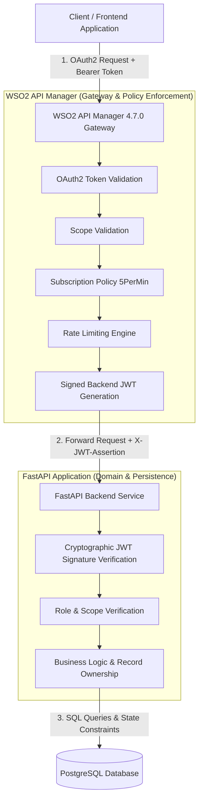
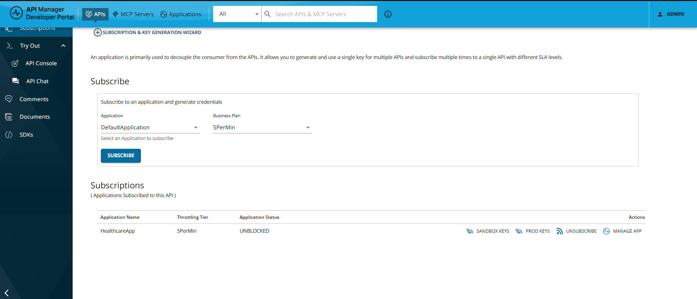
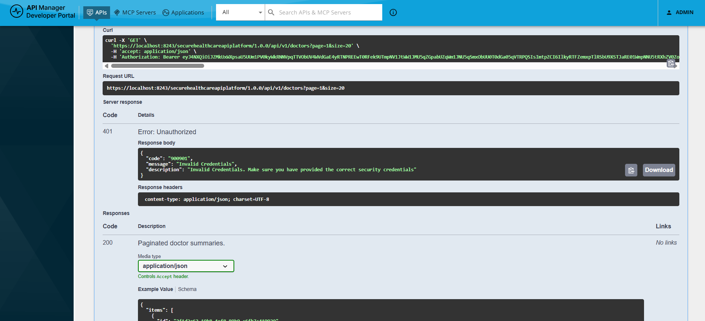
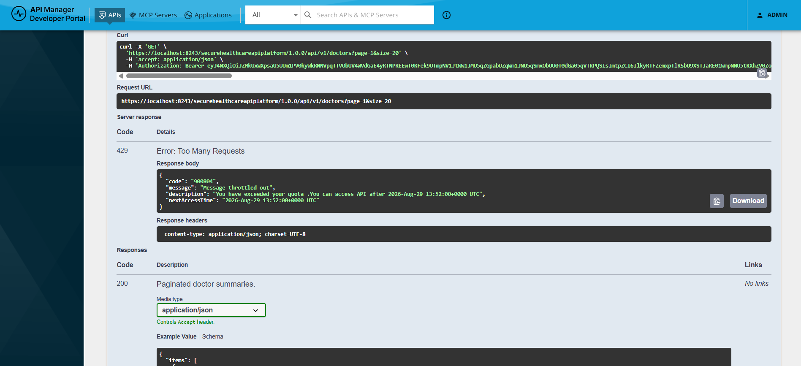

# Secure Healthcare API Platform

An educational, contract-first healthcare appointment API platform demonstrating end-to-end API lifecycle management, OAuth2 authorization, scope enforcement, rate limiting, and cryptographic backend token verification using **WSO2 API Manager 4.7.0**, **FastAPI**, and **PostgreSQL**.

---

## 1. Project Summary

The **Secure Healthcare API Platform** is designed to demonstrate enterprise API governance and zero-trust security patterns for healthcare appointment scheduling. It features a modern, containerized **FastAPI** backend fronted by **WSO2 API Manager 4.7.0** acting as the central API Gateway and Security Policy Enforcement Point.

All patient, doctor, and schedule data used in this platform are **entirely fictional**. The project adheres to a strict contract-first design methodology using OpenAPI 3.0.3, ensuring high architectural clarity and defense in depth across all tiers.

---

## 2. Key Features

- **Contract-First API Design:** Complete OpenAPI 3.0.3 specification defining data models, query parameters, scopes, error models (RFC 9457 Problem Details), and idempotency requirements.
- **Enterprise Gateway Integration:** API lifecycle management, OAuth2 authentication, scope verification, and subscription throttling governed by WSO2 API Manager 4.7.0.
- **Defense-in-Depth Security:** Two-tier authorization where WSO2 enforces coarse OAuth2 scopes at the perimeter, and FastAPI cryptographically verifies a signed backend assertion (`X-JWT-Assertion`) before enforcing fine-grained role and object-level permissions.
- **Cryptographic Backend JWT Verification:** FastAPI independently validates the RSA-signed JWT assertion (`RS256`), verifying issuer, expiration, not-before time, and signature against WSO2's public certificate or JWKS endpoint.
- **Fine-Grained Role & Ownership Rules:** Granular access controls ensuring patients can only view and manage their own appointments, doctors manage only their assigned appointments, and administrators manage the platform.
- **Subscription Throttling:** Custom rate-limiting policies (`5PerMin`) enforced at the WSO2 Gateway with standardized `429 Too Many Requests` responses.
- **Concurrency & Idempotency Controls:** Database-level unique constraints preventing double-booking of availability slots, coupled with client-provided `Idempotency-Key` headers for safe retries.
- **Production-Grade Code Quality:** Full test coverage (31 passing backend unit, integration, and security tests), strict MyPy typing across 52 source files, and 100% Ruff linting compliance.

---

## 3. Architecture


```mermaid
flowchart TD
    Client[Client / Frontend Application] -->|1. OAuth2 Request + Bearer Token| WSO2[WSO2 API Manager 4.7.0 Gateway]
    
    subgraph WSO2_GW["WSO2 API Manager (Gateway & Policy Enforcement)"]
        WSO2 --> WSO2_Auth[OAuth2 Token Validation]
        WSO2_Auth --> WSO2_Scope[Scope Validation]
        WSO2_Scope --> WSO2_Sub[Subscription Policy 5PerMin]
        WSO2_Sub --> WSO2_Rate[Rate Limiting Engine]
        WSO2_Rate --> WSO2_JWT[Signed Backend JWT Generation]
    end
    
    WSO2_JWT -->|2. Forward Request + X-JWT-Assertion| FastAPI[FastAPI Backend Service]
    
    subgraph Backend_App["FastAPI Application (Domain & Persistence)"]
        FastAPI --> API_JWT[Cryptographic JWT Signature Verification]
        API_JWT --> API_Auth[Role & Scope Verification]
        API_Auth --> API_Logic[Business Logic & Record Ownership]
    end
    
    API_Logic -->|3. SQL Queries & State Constraints| DB[(PostgreSQL Database)]
```

### Architectural Boundaries & Responsibilities

| Component | Responsibility | Security Boundary |
| :--- | :--- | :--- |
| **Client Application** | Initiates requests via OAuth 2.0 Authorization Code with PKCE. | Untrusted Boundary |
| **WSO2 API Manager** | API lifecycle, OAuth2 verification, scope enforcement, subscription throttling, stripping client assertion headers, and generating signed backend JWTs. | Gateway Boundary (Perimeter) |
| **FastAPI Backend** | Cryptographic verification of `X-JWT-Assertion`, role checks, object ownership validation, domain business logic, idempotency, and audit logging. | Application Boundary (Internal) |
| **PostgreSQL** | Authoritative relational data store, ACID transactions, slot uniqueness constraints, and foreign key integrity. | Data Persistence Boundary |

---

## 4. WSO2 API Manager Integration

WSO2 API Manager 4.7.0 is an active, foundational component of the architecture, serving as the API Gateway and governance engine:

- **API Lifecycle & Versioning:** The API is managed under context `/healthcare` with version `1.0.0` (accessible at `/healthcare/1.0.0`).
- **Publisher Portal (`https://localhost:9443/publisher`):** Imports the OpenAPI contract, maps backend HTTP endpoints, defines operational policies, and manages API lifecycle states (Created, Deployed, Published).
- **Developer Portal (`https://localhost:9443/devportal`):** Enables application registration (`HealthcareWebApp`), tier subscriptions, OAuth2 credential generation (Authorization Code with PKCE / Client Credentials), and API exploration.
- **Admin Portal (`https://localhost:9443/admin`):** Configures custom throttling policies (such as `5PerMin`) and rate-limiting tiers.
- **Classic Gateway HTTPS (`https://localhost:8243`):** Intercepts client traffic, performs token validation, enforces scopes, drops rate-exceeded requests, strips client-supplied assertion headers, and routes validated traffic to FastAPI.
- **Signed Backend JWT Assertion:** When enabled (`[apim.jwt]` in `deployment.toml`), WSO2 creates a short-lived backend JWT in the `X-JWT-Assertion` header containing authenticated subject (`sub`), mapped roles (`roles`), and granted scopes (`scope`), signed with the gateway's RSA private key (`SHA256withRSA`).

---

## 5. Security Flow

The complete end-to-end request lifecycle follows a 10-step zero-trust pattern:

```text
Client -> [1. OAuth2 Token] -> WSO2 Gateway
                                   |
                                   +--> [2. Validate OAuth2 Token]
                                   +--> [3. Validate Scopes]
                                   +--> [4. Apply Subscription / Rate Limits]
                                   +--> [5. Strip untrusted assertion headers]
                                   +--> [6. Sign & inject X-JWT-Assertion]
                                   |
                                   v
FastAPI Backend <------------------+ [7. Forward Request + X-JWT-Assertion]
   |
   +--> [8. Cryptographically verify signature, issuer, exp, and algorithms]
   +--> [9. Enforce Role & Object-Level Ownership (Patient/Doctor/Admin)]
   +--> [10. Execute Transaction in PostgreSQL & Return Response via WSO2]
```

1. **Client Token Acquisition:** Client obtains an OAuth2 access token from WSO2 via Authorization Code with PKCE.
2. **Gateway Invocation:** Client calls the API via the WSO2 Gateway (`https://localhost:8243/healthcare/1.0.0/...`).
3. **Token Validation:** WSO2 validates token signature, expiration, and active status.
4. **Perimeter Scope Validation:** WSO2 verifies that the token possesses the required OAuth2 scope for the target operation.
5. **Subscription & Throttling Enforcement:** WSO2 checks application subscription tiers and rate limits (e.g., `5PerMin`).
6. **Assertion Injection:** WSO2 strips any incoming client `X-JWT-Assertion` header and generates its own signed assertion containing verified subject, roles, and scopes.
7. **Backend Forwarding:** WSO2 forwards the request with the signed `X-JWT-Assertion` to FastAPI.
8. **Cryptographic JWT Verification:** FastAPI verifies the assertion's RSA signature using WSO2's public certificate (`backend-signing.crt`) or JWKS endpoint, checking issuer (`wso2.org/products/am`), algorithm (`RS256`), and expiration.
9. **Fine-Grained Authorization:** FastAPI extracts the principal (`AuthenticatedUser`) and enforces role requirements and record ownership (e.g., matching authenticated patient ID against appointment owner).
10. **Database Execution:** FastAPI interacts with PostgreSQL within an isolated database transaction, returning sanitized data back through WSO2 to the client.

---

## 6. Authorization and Scope Model

### OAuth2 Scopes

| Scope | Description |
| :--- | :--- |
| `doctor:read` | Read public doctor directory and profile information |
| `doctor:write` | Create, update, or deactivate doctor profiles (Admin only) |
| `availability:read` | View doctor schedule availability slots |
| `availability:write` | Create or update availability slots (Doctor / Admin) |
| `appointment:create` | Book new appointments (Patient) |
| `appointment:read` | View owned or assigned appointment details |
| `appointment:read:all`| View all appointment records administratively (Admin only) |
| `appointment:update` | Update appointment statuses (Doctor / Admin / Patient cancel) |
| `appointment:cancel` | Cancel an owned or assigned appointment |
| `patient:read` | Read masked patient account summaries (Admin only) |
| `patient:write` | Manage patient account state (Admin only) |
| `admin:manage` | Perform system-wide administrative operations |

### Role-to-Scope Mapping

| Role | Permitted Scopes |
| :--- | :--- |
| **Patient** | `doctor:read`, `availability:read`, `appointment:create`, `appointment:read`, `appointment:cancel` |
| **Doctor** | `doctor:read`, `availability:read`, `availability:write`, `appointment:read`, `appointment:update`, `appointment:cancel` |
| **Administrator** | `doctor:read`, `doctor:write`, `availability:read`, `availability:write`, `appointment:create`, `appointment:read`, `appointment:read:all`, `appointment:update`, `appointment:cancel`, `patient:read`, `patient:write`, `admin:manage` |

### Defense-in-Depth Authorization Matrix

```text
Request -> WSO2 Scope Check -> FastAPI Signature Check -> FastAPI Role Check -> Object Ownership Check -> Database
```

- **IDOR / Resource Enumeration Protection:** Inaccessible or unassigned records return a concealed `404 Not Found` rather than `403 Forbidden`, preventing malicious actors from enumerating resource UUIDs.
- **Patient Isolation:** Patients can only access appointments associated with their verified subject UUID (`/api/v1/patients/me/appointments`).
- **Doctor Assignment:** Doctors can only update status for appointments assigned to their doctor UUID.

---

## 7. API Throttling

Throttling is managed at the WSO2 Gateway layer to protect backend services from resource exhaustion:

- **Custom Subscription Tier:** Configured with a `5PerMin` (5 requests per minute) demonstration policy.
- **Rejection Behavior:** When the request rate exceeds the quota, WSO2 immediately halts the request and returns an HTTP `429 Too Many Requests` status.
- **Observed WSO2 Throttling Response Payload:**
  ```json
  {
    "code": "900804",
    "message": "Message throttled out",
    "description": "You have exceeded your quota"
  }
  ```

---

## 8. Technology Stack

| Layer / Concern | Technology | Details / Version |
| :--- | :--- | :--- |
| **API Gateway & Manager** | WSO2 API Manager | 4.7.0 (OAuth2, OIDC, JWT Assertion, Rate Limiting) |
| **Backend Framework** | FastAPI / Python | Python 3.12, Uvicorn, Pydantic v2, Pydantic-Settings |
| **Database & ORM** | PostgreSQL & SQLAlchemy | PostgreSQL 17, SQLAlchemy 2.0 (async/typed), Alembic |
| **Security & Cryptography**| PyJWT & Cryptography | RS256, X.509 Certificate Loading, JWKS caching |
| **Containerization** | Docker & Docker Compose | Multi-container setup (`db`, `api`, `frontend`) |
| **Code Quality & Typing** | Ruff, MyPy, Pytest | Ruff 0.8+ (lint/format), MyPy (strict), Pytest 8.3+ |
| **Client UI** | React & TypeScript | Vite, TailwindCSS, OAuth2 Authorization Code + PKCE |

---

## 9. Project Structure

```text
secure-healthcare-api-platform/
├── api-spec/
│   └── healthcare-api.yaml                 # Authoritative OpenAPI 3.0.3 Contract
├── apiops/
│   ├── apictl/                             # WSO2 API Controller project & environment configs
│   ├── config/                             # Environment parameter templates (.env.example)
│   ├── docs/                               # Promotion and rollback strategies
│   └── scripts/                            # Validation, contract check, and deployment scripts
├── backend/
│   ├── alembic/                            # Database migrations (PostgreSQL schemas)
│   ├── app/
│   │   ├── api/                            # API routes (v1) and dependency injection
│   │   ├── core/                           # Security, JWT validation, config, middleware, logging
│   │   ├── db/                             # Database engine and session management
│   │   ├── models/                         # SQLAlchemy ORM models
│   │   ├── repositories/                   # Data access repositories
│   │   ├── schemas/                        # Pydantic validation models
│   │   └── services/                       # Business logic and domain services
│   ├── tests/                              # Unit, integration, and security test suites
│   ├── Dockerfile                          # Non-root container definition
│   └── pyproject.toml                      # Dependencies, Ruff, MyPy, and Pytest configuration
├── database/                               # Schema documentation and reference SQL
├── docs/                                   # Architectural specifications, security models, matrices
│   ├── images/                             # Verified runtime execution screenshots
│   │   ├── 02-subscription.png
│   │   ├── 03-401-missing-token.png
│   │   └── 06-429-throttling.png
├── e2e/                                    # Playwright end-to-end test suite
├── frontend/                               # React + TypeScript client application
├── wso2/
│   ├── api/                                # WSO2-specific OpenAPI contract & import notes
│   ├── certs/                              # Public backend-signing certificate (public key only)
│   ├── config/                             # Scope, role, and rate-limit configuration maps
│   ├── postman/                            # Local WSO2 Postman collection & environment
│   └── scripts/                            # PowerShell and Bash gateway smoke tests
├── docker-compose.yml                      # Container orchestration (PostgreSQL, FastAPI, Frontend)
└── README.md                               # Project documentation
```

---

## 10. Getting Started

### Prerequisites

- **Docker Desktop** (v24.0+ or compatible) with Docker Compose
- **Python 3.12+**
- **Java JDK 21+** (for running WSO2 API Manager locally)
- **WSO2 API Manager 4.7.0** (downloaded from official WSO2 distribution)
- **PowerShell 7+** (Windows) or **Bash** (Linux/macOS)

---

## 11. Environment Configuration

Copy `.env.example` to `.env` in the root directory and `backend/.env.example` to `backend/.env`.

> [!IMPORTANT]
> Never commit actual passwords, private keys, client secrets, or OAuth tokens to the repository. The example files provide non-secret placeholders only.

### Key Configuration Variables

| Variable | Description | Example Default |
| :--- | :--- | :--- |
| `APP_NAME` | Service name identifier | `secure-healthcare-api` |
| `APP_ENV` | Application environment (`development`, `test`, `production`) | `development` |
| `AUTH_MODE` | Authentication mode (`wso2_backend_jwt`, `direct_jwt`, `test_override`) | `wso2_backend_jwt` |
| `DATABASE_URL` | PostgreSQL connection string | `postgresql+psycopg://...` |
| `WSO2_BACKEND_JWT_HEADER` | Header name for WSO2 signed backend assertion | `X-JWT-Assertion` |
| `WSO2_BACKEND_JWT_ISSUER` | Expected assertion issuer | `wso2.org/products/am` |
| `WSO2_BACKEND_JWT_ALGORITHMS` | Allowed asymmetric signing algorithms | `RS256` |
| `WSO2_BACKEND_JWT_PUBLIC_KEY_PATH` | Path to WSO2 public certificate (`.crt`) | `/run/wso2/backend-signing.crt` |
| `WSO2_BACKEND_JWT_JWKS_URL` | Gateway JWKS endpoint for public key retrieval | `https://localhost:8243/jwks` |
| `WSO2_SUBJECT_CLAIM` | Claim name for authenticated user ID | `sub` |
| `WSO2_ROLE_CLAIM` | Claim name for user roles | `roles` |
| `WSO2_SCOPE_CLAIM` | Claim name for granted scopes | `scope` |
| `TRUSTED_GATEWAY_HOSTS` | Allowlisted hostnames/IPs for direct gateway requests | `localhost,127.0.0.1,172.18.0.1` |
| `ALLOW_DIRECT_ACCESS` | Allow bypassing gateway IP check in local development | `false` |

---

## 12. Running with Docker

1. **Build and start services:**
   ```bash
   docker compose up --build -d
   ```

2. **Apply database migrations:**
   ```bash
   docker compose exec api alembic upgrade head
   ```

3. **Verify backend health directly:**
   ```bash
   curl http://localhost:8000/health
   ```
   *Response:* `{"status":"ok"}`

---

## 13. Running WSO2 API Manager Locally

1. **Configure Backend JWT in WSO2:**
   Open `<WSO2_AM_HOME>/repository/conf/deployment.toml` and ensure backend JWT generation is enabled:
   ```toml
   [apim.jwt]
   enable = true
   encoding = "base64url"
   header = "X-JWT-Assertion"
   signing_algorithm = "SHA256withRSA"
   ```

2. **Start WSO2 API Manager:**
   - **Windows:**
     ```powershell
     cd <WSO2_AM_HOME>\bin
     .\api-manager.bat
     ```
   - **Linux/macOS:**
     ```bash
     cd <WSO2_AM_HOME>/bin
     ./api-manager.sh
     ```

3. **Access WSO2 Portals:**
   - **Publisher Portal:** `https://localhost:9443/publisher`
   - **Developer Portal:** `https://localhost:9443/devportal`
   - **Admin Portal:** `https://localhost:9443/admin`
   - **HTTPS Gateway:** `https://localhost:8243`
   *(Use your local WSO2 administrator credentials).*

4. **Mount WSO2 Signing Certificate (for local backend JWT verification):**
   Export WSO2's public certificate and place it at `wso2/certs/backend-signing.crt` to allow FastAPI to verify `X-JWT-Assertion` signatures without needing network round trips to JWKS during local testing.

---

## 14. Publishing the API to WSO2

1. **Import API Definition:**
   - Navigate to the **Publisher Portal** (`https://localhost:9443/publisher`).
   - Select **Create API** > **Import OpenAPI**.
   - Upload `wso2/api/healthcare-api-wso2.yaml` (or reference `api-spec/healthcare-api.yaml`).
   - Set **Context:** `/healthcare` and **Version:** `1.0.0`.
   - Set **Endpoint:** `http://localhost:8000` (or `http://host.docker.internal:8000` when running WSO2 on host).

2. **Configure Scopes & Resources:**
   - Create the OAuth2 scopes under **Local Scopes** according to `wso2/config/scopes.yaml`.
   - Attach operation scopes to resources using `wso2/config/api-resource-scope-mapping.yaml`.
   - Ensure `/health` has **Authentication: None** and unneeded administrative endpoints (like `/ready`) are not exposed.

3. **Deploy & Publish:**
   - Create a new revision in the **Deployments** tab and deploy to the `Default Gateway`.
   - Under **Lifecycle**, transition the API from `Created` to `Published`.

---

## 15. Testing the API through WSO2

1. **Subscribe via Developer Portal:**
   - Sign in to `https://localhost:9443/devportal`.
   - Create an application (`HealthcareWebApp`).
   - Subscribe the application to `Secure Healthcare API - 1.0.0` using the `5PerMin` throttling policy.

2. **Generate an OAuth2 Access Token:**
   - Under **Production Keys** > **OAuth2 Tokens**, generate a token including the `doctor:read` scope.

3. **Invoke Protected Endpoint via Gateway:**
   - **PowerShell:**
     ```powershell
     $headers = @{
         Authorization = "Bearer <YOUR_WSO2_ACCESS_TOKEN>"
     }
     Invoke-RestMethod -Uri "https://localhost:8243/healthcare/1.0.0/api/v1/doctors" -Headers $headers -SkipCertificateCheck
     ```
   - **cURL:**
     ```bash
     curl -k -X GET "https://localhost:8243/healthcare/1.0.0/api/v1/doctors" \
       -H "Authorization: Bearer <YOUR_WSO2_ACCESS_TOKEN>"
     ```

4. **Run Gateway Smoke Test Script:**
   ```powershell
   $env:WSO2_ACCESS_TOKEN = "<YOUR_TEMPORARY_TOKEN>"
   $env:ALLOW_INSECURE_LOCAL_TLS = "true"
   .\wso2\scripts\gateway-smoke-test.ps1
   ```

---

## 16. Verified Runtime Results

The following end-to-end runtime security scenarios have been verified against the live environment:

| Scenario | Expected Result | Verified | Notes / Error Code |
| :--- | :--- | :---: | :--- |
| **Request without token** | `401 Unauthorized` | **Yes** | Gateway rejects unauthenticated traffic before hitting FastAPI. |
| **Token without required scope** | `403 Forbidden` | **Yes** | Gateway rejects token lacking `doctor:read`. |
| **Valid `doctor:read` token** | `200 OK` | **Yes** | Gateway forwards request; FastAPI returns doctor list. |
| **Signed WSO2 backend JWT** | Successfully verified | **Yes** | FastAPI verifies `X-JWT-Assertion` RS256 signature and claims. |
| **Exceeding 5 requests/min quota** | `429 Too Many Requests` | **Yes** | WSO2 throttles: `code: 900804`, `Message throttled out`. |

---

## 17. Automated Testing and Code Quality

The backend codebase adheres to strict engineering standards and automated testing:

```text
Backend Test Suite : 31 passed in 1.40s
Ruff Linter        : All checks passed!
Ruff Formatter     : Formatted according to project guidelines
MyPy Type Checker  : Success, no issues found in 52 source files (strict mode)
```

### Running Quality Checks Locally

```powershell
# Run Ruff linting
python -m ruff check backend

# Run strict MyPy type checking
python -m mypy --config-file backend/pyproject.toml backend/app

# Run Pytest suite
python -m pytest backend/tests
```

---

## 18. API Endpoints Overview

| Method | Path | Required Scope | Role Policy | Description |
| :--- | :--- | :--- | :--- | :--- |
| `GET` | `/health` | *None (Public)* | Any | Basic service health check |
| `GET` | `/ready` | *Internal* | System | Database readiness check (not exposed on gateway) |
| `GET` | `/api/v1/doctors` | `doctor:read` | Patient, Doctor, Admin | List active doctors (paginated, filtered) |
| `POST` | `/api/v1/doctors` | `doctor:write`, `admin:manage` | Admin only | Register a new doctor |
| `GET` | `/api/v1/doctors/{doctorId}` | `doctor:read` | Patient, Doctor, Admin | Get doctor details by ID |
| `PATCH`| `/api/v1/doctors/{doctorId}` | `doctor:write`, `admin:manage` | Admin only | Update doctor profile |
| `DELETE`| `/api/v1/doctors/{doctorId}` | `doctor:write`, `admin:manage`| Admin only | Soft-delete / deactivate doctor |
| `GET` | `/api/v1/doctors/{doctorId}/availability` | `availability:read` | Patient, Doctor, Admin | List available scheduling slots |
| `POST` | `/api/v1/doctors/{doctorId}/availability` | `availability:write` | Doctor (own), Admin | Create availability slot |
| `POST` | `/api/v1/appointments` | `appointment:create` | Patient | Book appointment (idempotent) |
| `GET` | `/api/v1/appointments/{appointmentId}` | `appointment:read` | Owner, Doctor, Admin | Get appointment details (404 if not owned) |
| `PATCH`| `/api/v1/appointments/{appointmentId}` | `appointment:update` | Owner (cancel), Doctor, Admin | Update status (checked-in, completed, etc.) |
| `GET` | `/api/v1/patients/me/appointments` | `appointment:read` | Patient | View authenticated patient's appointments |
| `GET` | `/api/v1/admin/appointments` | `appointment:read:all`, `admin:manage` | Admin only | Administrative overview of all appointments |
| `GET` | `/api/v1/admin/patients` | `patient:read`, `admin:manage` | Admin only | List masked patient account summaries |

---

## 19. Screenshots / Evidence

The following runtime verification screenshots provide visual evidence of the active WSO2 API Manager integration and gateway policy enforcement:

### 1. Developer Portal Application Subscription & Throttling Tier


*Application HealthcareWebApp subscribed to Secure Healthcare API 1.0.0 with the custom 5PerMin rate-limiting policy.*

---

### 2. HTTP 401 Unauthorized (Missing OAuth Token)


*Unauthenticated gateway request rejected immediately by WSO2 API Manager with HTTP 401 before reaching the backend.*

---

### 3. HTTP 429 Too Many Requests (WSO2 Rate Limiting Policy Exceeded)


*WSO2 Gateway throttling response (code: 900804, Message throttled out) when request rate exceeds the allocated quota.*

---

## 20. Security Notes

- **Cryptographic Validation:** When configured in `AUTH_MODE=wso2_backend_jwt`, FastAPI rejects any plain HTTP identity headers (`X-User-ID`, `X-Role`, etc.) and requires a cryptographically valid `X-JWT-Assertion`.
- **Header Overwrite Protection:** WSO2 Gateway is configured to strip incoming client assertion headers to prevent assertion spoofing.
- **Concealed 404 Pattern:** Inaccessible appointments return `404 Not Found` instead of `403 Forbidden` to eliminate ID enumeration vectors.
- **Idempotent Operations:** Appointment bookings accept an optional `Idempotency-Key` header, caching responses and preventing duplicate records under network retries.
- **Sanitized Logging:** Request bodies containing sensitive healthcare reasons, authorization headers, and JWT assertions are strictly redacted from application logs.

---

## 21. Limitations

- **Local / Demonstration Deployment:** Designed and tested for local containerized environments and local WSO2 instances; not configured for multi-region cloud production.
- **Domain Scope:** Focuses specifically on scheduling, doctor directories, and availability. Excludes electronic health record (EHR) features, clinical notes, prescriptions, laboratory results, and billing.
- **Manual WSO2 Runtime Setup:** WSO2 API Manager 4.7.0 is run as a separate local service outside the Docker Compose file, with manual or script-assisted portal import.

---

## 22. Educational Disclaimer

> [!CAUTION]
> **EDUCATIONAL USE ONLY:** This repository is developed solely for educational, technical demonstration, and project evaluation purposes.
> - All patient identities, doctor names, schedules, and clinical appointment reasons are **entirely fictional**.
> - **No Regulatory Compliance Claimed:** This system does **NOT** claim compliance with HIPAA, GDPR, HITECH, or regional healthcare data regulations.
> - **No FHIR Compliance:** This API does **NOT** claim compliance with HL7 FHIR standards.
> - **Never Use Real Medical Data:** Do not store, process, or transmit real patient or Protected Health Information (PHI) within this platform.
