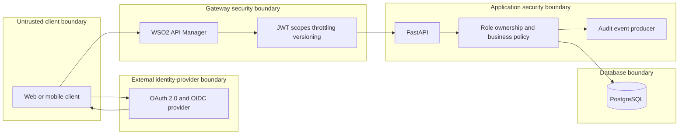
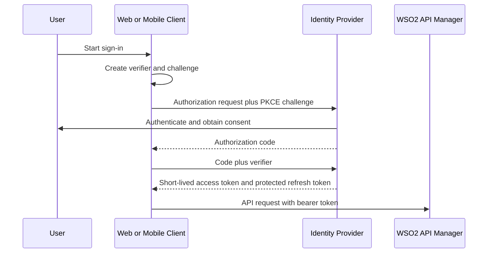
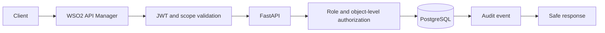
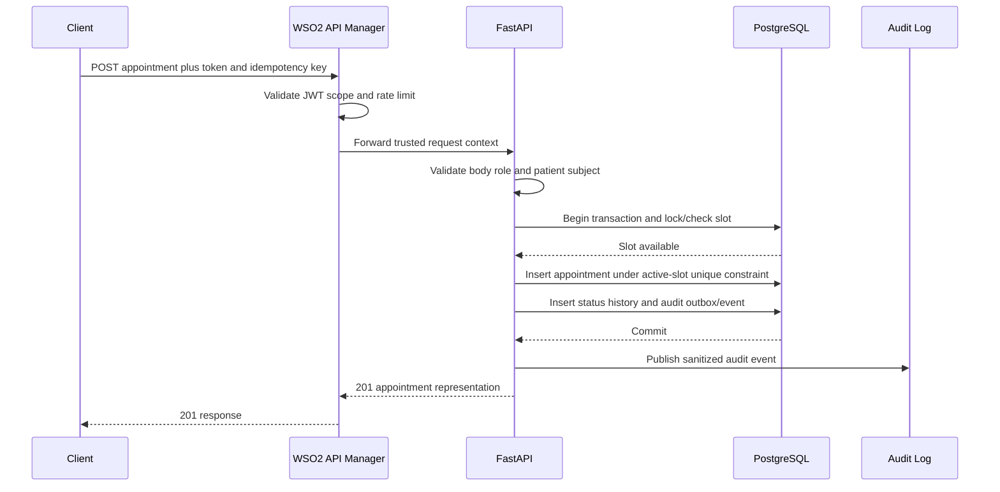

# Architecture

## System context and responsibilities

The web/mobile client obtains OAuth/OIDC tokens from an external identity provider and calls the published API through a future WSO2 API Manager gateway. WSO2 owns publication, coarse JWT/scope validation, throttling, version routing, analytics, and gateway policies. FastAPI owns request validation, role and object-level authorization, business rules, transaction boundaries, safe errors, and audit-event production. PostgreSQL is the system of record.

## OAuth login flow

Authorization Code with PKCE is used for people. Client Credentials is reserved for trusted service identities and never impersonates a patient.

## Protected API request flow

1. The client sends a bearer token and correlation metadata over HTTPS.
2. WSO2 validates token integrity and coarse scopes and applies rate/version policies.
3. FastAPI validates the request contract and trusted identity context.
4. Backend policy checks role plus ownership/doctor assignment; failures are denied by default.
5. A transaction queries or mutates PostgreSQL and writes an audit event as required.
6. The API returns an allowlisted response or an RFC 9457 problem; the gateway adds safe telemetry.

## Appointment creation sequence

Concurrent attempts for the same slot rely on the database constraint; exactly one may succeed, and the loser receives `409`.

## Authorization and error flow

Authentication establishes the subject. Scopes establish coarse capability. Trusted roles establish functional permission. Database-backed ownership or assignment establishes object access. Failure at any layer stops processing. Inaccessible object responses use safe `404` where existence would enable enumeration; other policy failures use safe `403`. Validation, conflict, throttling, and unexpected errors use RFC 9457 without stack traces.

## Logging flow

Gateway access telemetry and FastAPI application logs contain request IDs, route templates, status, duration, and non-sensitive actor/service identifiers. Security audit logs separately record action, outcome, actor subject, target type/opaque ID, time, trace ID, and policy reason category. Log pipelines redact tokens, contact data, appointment reasons, request bodies, and credentials. Audit storage has stricter access and retention controls.

## Trust and security boundaries

- **Client boundary:** input and client-supplied claims/IDs are untrusted.
- **Identity-provider boundary:** signing keys, issuer, audience, and claims contract must be pinned and monitored.
- **Gateway boundary:** only explicitly configured routes/scopes are published; gateway headers are accepted only from authenticated gateway traffic.
- **Application boundary:** FastAPI does not assume gateway validation replaces backend authorization.
- **Database boundary:** least-privileged credentials, encrypted connections/storage, transactions, constraints, backups, and restricted network access.

## Future WSO2 integration

Import the OpenAPI contract, replace placeholder authorization/token URLs, map scopes to gateway resources, configure subscriptions and throttling, enforce TLS, remove direct public backend access, propagate verified identity safely, publish lifecycle/version metadata, and enable sanitized analytics. The final topology and claims contract must undergo a security review before deployment.
