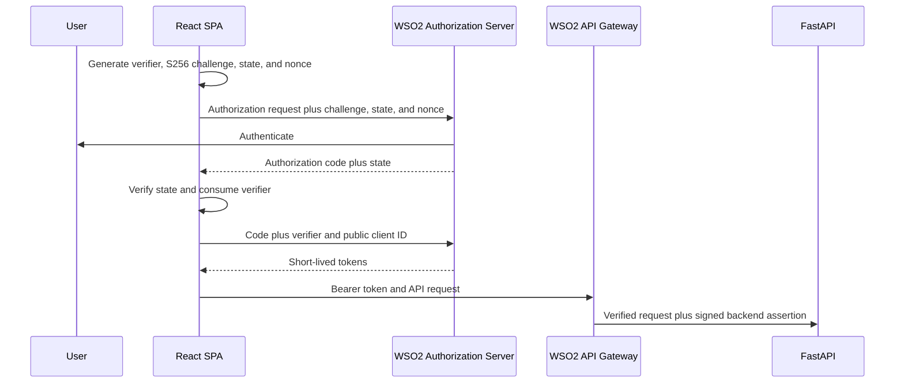

# Frontend authentication

The React SPA is a public OAuth client and uses Authorization Code with PKCE S256. It has no client secret because browser-delivered code cannot keep one confidential.

The verifier, state, nonce, and safe return route are stored only for the authorization transaction in session storage and are deleted before callback validation proceeds. The client checks state, nonce, ID-token audience, and expiry before using allowlisted display claims. Access tokens remain in module memory, never URLs, UI, logs, local storage, or telemetry. Reloading the SPA requires reauthentication. No insecure refresh-token persistence is implemented.

The ID token is decoded only after the token endpoint response to construct navigation hints. Claims are type-checked and roles are allowlisted to `patient`, `doctor`, and `administrator`; this client-side decoding is not token validation or authorization. WSO2 validates client tokens and scopes, while FastAPI validates the signed backend assertion, role, ownership/assignment, and business rules.

Create a WSO2 public application with Authorization Code and PKCE, redirect URI `http://localhost:5173/auth/callback`, logout redirect `http://localhost:5173/login`, and only required scopes. Configure the gateway API CORS policy for `http://localhost:5173`, required methods/headers, and trusted TLS. The browser base URL must remain `https://localhost:8243/healthcare/1.0.0` locally, never direct FastAPI.

SPA token exposure remains possible under successful same-origin script injection; use a strict CSP, dependency review, short token lifetimes, secure headers, and no sensitive DOM injection. Logout clears local memory and PKCE data before redirecting to WSO2. HTTP 401 also clears authentication and requires sign-in.
